```mermaid
classDiagram
    %% Core Components
    class DOPAdapter {
        -dataModel: DataModel
        -behaviorModel: BehaviorModel
        -stateMachineMinimizer: StateMachineMinimizer
        -renderStrategy: RenderStrategy
        +createFromFunctional(config: FunctionalConfig): Component
        +createFromClass(componentClass: Class): Component
        +getState(): State
        +setState(newState: State): void
        +applyTransition(name: string, payload: any): void
        +optimizeStateMachine(): void
        +precomputeTransition(name: string, pattern: Object): void
    }

    class DataModel {
        -immutableState: Object
        -transitionMaps: Map~string, Function~
        -validationRules: Map~string, Function~
        -equivalenceClasses: Map~number, Set~State~~
        -optimizedAST: ASTNode
        +getState(): Object
        +setState(newState: Object): void
        +getTransitionMap(name: string): Function
        +setTransitionMap(name: string, fn: Function): void
        +validateState(state: Object): boolean
        +computeEquivalenceClasses(): Map
        +optimizeAST(): ASTNode
    }

    class BehaviorModel {
        -stateTransitions: Map~string, Function~
        -eventHandlers: Map~string, Function~
        -lifecycleHooks: Map~string, Function~
        -diffingAlgorithm: Function
        +applyTransition(name: string, state: Object, payload: any): Object
        +handleEvent(name: string, payload: any): void
        +registerLifecycleHook(name: string, handler: Function): void
        +triggerLifecycleHook(name: string, args: any[]): void
        +computeDiff(oldState: Object, newState: Object): Array
    }

    %% Parser Components
    class HTMLParser {
        -tokenizer: HTMLTokenizer
        -ast: ASTNode
        -states: Set~State~
        -equivalenceClasses: Map
        +parse(input: string): ASTNode
        -processToken(token: Token): void
        -buildAST(tokens: Token[]): ASTNode
        -minimizeStates(): void
        -optimizeAST(ast: ASTNode): ASTNode
    }

    class HTMLTokenizer {
        -input: string
        -position: number
        -tokens: Token[]
        +tokenize(): Token[]
        -consumeToken(): Token
        -readTag(): Token
        -readAttribute(): Attribute
        -readText(): Token
        -readComment(): Token
    }

    class HTMLToken {
        +type: string
        +value: string
        +attributes: Map
        +selfClosing: boolean
        +metadata: Object
    }

    class HTMLAstOptimizer {
        -stateClasses: Map
        -nodeSignatures: Map
        -minimizedNodes: WeakMap
        +optimize(ast: ASTNode): ASTNode
        -buildStateClasses(ast: ASTNode): void
        -computeNodeSignature(node: ASTNode): string
        -optimizeNode(node: ASTNode): ASTNode
        -optimizeChildren(children: ASTNode[]): ASTNode[]
        -applyMemoryOptimizations(node: ASTNode): void
    }

    %% State Machine Components
    class StateMachine {
        -states: Map~string, State~
        -initialState: State
        -currentState: State
        -alphabet: Set~string~
        -isMinimized: boolean
        +addState(id: string, value: any): State
        +getState(id: string): State
        +setInitialState(stateId: string): void
        +addTransition(fromId: string, symbol: string, toId: string): void
        +transition(symbol: string): State
        +reset(): void
        +processSequence(symbols: string[]): State
    }

    class State {
        -id: string
        -value: any
        -transitions: Map~string, State~
        -metadata: StateMetadata
        +getId(): string
        +getValue(): any
        +getTransitions(): Map
        +addTransition(symbol: string, target: State): void
        +getNextState(symbol: string): State
        +hasTransition(symbol: string): boolean
        +computeStateSignature(classes: Map): string
        +setEquivalenceClass(classId: number): void
    }

    class StateMachineMinimizer {
        -options: MinimizationOptions
        +minimize(stateMachine: StateMachine): StateMachine
        -computeEquivalenceClasses(stateMachine: StateMachine): Map
        -createMinimizedMachine(original: StateMachine, classes: Map): StateMachine
        -applyMemoryOptimizations(stateMachine: StateMachine): void
    }

    %% Diff and Patch Engine
    class DiffPatchEngine {
        -options: DiffOptions
        +diff(oldTree: ASTNode, newTree: ASTNode): Patch[]
        +patch(target: ASTNode, patches: Patch[]): ASTNode
        -findNodeDifferences(oldNode: ASTNode, newNode: ASTNode): Difference[]
        -createPatch(differences: Difference[]): Patch[]
        -applyPatch(target: ASTNode, patch: Patch): void
        -optimizePatch(patches: Patch[]): Patch[]
    }

    %% AST Components
    class ASTNode {
        -type: string
        -value: any
        -children: ASTNode[]
        -parent: ASTNode
        -metadata: NodeMetadata
        +addChild(node: ASTNode): void
        +removeChild(node: ASTNode): void
        +clone(): ASTNode
        +computeSignature(): string
    }

    %% Public APIs
    class Component {
        <<interface>>
        +state: Object
        +trigger(event: string, payload?: any): void
        +subscribe(listener: Function): Function
    }

    class FunctionalComponent {
        +initialState: Object
        +transitions: Object
        +render(state: Object, trigger: Function): RenderOutput
        +state: Object
        +trigger(event: string, payload?: any): void
        +subscribe(listener: Function): Function
    }

    class OOPComponent {
        +initialState: Object
        +[methodName: string]: Function
        +render(state: Object): RenderOutput
        +state: Object
        +trigger(event: string, payload?: any): void
        +subscribe(listener: Function): Function
        +_onMount(): void
        +_onUpdate(prevState: Object, newState: Object): void
        +_onUnmount(): void
    }

    %% Caching System
    class TransitionCache {
        -cache: Map~string, CachedTransition~
        -options: CacheOptions
        -metrics: CacheMetrics
        +get(key: string): Object
        +set(key: string, value: Object): void
        +has(key: string): boolean
        +clear(): void
        +getMetrics(): CacheMetrics
        -generateKey(state: Object, transition: string): string
    }

    %% Relationships
    DOPAdapter ..> StateMachineMinimizer : uses
    DOPAdapter "1" *-- "1" DataModel : contains
    DOPAdapter "1" *-- "1" BehaviorModel : contains
    DOPAdapter ..> TransitionCache : uses
    DOPAdapter ..> FunctionalComponent : creates
    DOPAdapter ..> OOPComponent : creates
    
    FunctionalComponent --|> Component : implements
    OOPComponent --|> Component : implements
    
    StateMachineMinimizer --> StateMachine : optimizes
    State --o StateMachine : composed in
    
    HTMLParser --> HTMLTokenizer : uses
    HTMLParser --> HTMLAstOptimizer : uses
    HTMLParser --> ASTNode : creates
    HTMLTokenizer --> HTMLToken : produces
    
    HTMLAstOptimizer --> ASTNode : optimizes
    
    DiffPatchEngine --> ASTNode : compares and modifies
    
    BehaviorModel ..> DiffPatchEngine : uses
    DataModel ..> HTMLAstOptimizer : uses
    DataModel ..> ASTNode : manages

```

## OBIX Core Architecture: TypeScript Type Definitions

Based on the UML diagram and your project structure, here are the core TypeScript type definitions for the OBIX parser module:

### Parser Module Structure

The parser module is a critical component of OBIX, responsible for converting HTML/JSX markup into optimized abstract syntax trees that can be minimized using automaton state minimization techniques. The module is structured as follows:

```typescript
// parser/index.d.ts
declare module 'obix/parser' {
  export { HTMLParser } from './html';
  export { HTMLTokenizer, Token, TokenType } from './tokenizer';
  export { HTMLAstOptimizer } from './ast/optimizer';
  export { ParserError } from './error';
  export { ParserOptions, TokenizerOptions } from './types';
}

// parser/html/index.d.ts
declare module 'obix/parser/html' {
  import { ASTNode } from 'obix/core/ast';
  import { Token } from 'obix/parser/tokenizer';
  import { ParserOptions } from 'obix/parser/types';

  export class HTMLParser {
    constructor(options?: ParserOptions);
    parse(input: string): ASTNode;
    parseToken(token: Token): void;
    buildAST(tokens: Token[]): ASTNode;
    minimizeStates(): void;
    optimizeAST(ast: ASTNode): ASTNode;
  }
}

// parser/tokenizer/index.d.ts
declare module 'obix/parser/tokenizer' {
  import { TokenizerOptions } from 'obix/parser/types';

  export enum TokenType {
    StartTag,
    EndTag,
    Text,
    Comment,
    Doctype,
    CDATA,
    EOF
  }

  export interface Token {
    type: TokenType;
    value: string;
    attributes?: Map<string, string>;
    selfClosing?: boolean;
    metadata?: Record<string, any>;
  }

  export class HTMLTokenizer {
    constructor(input: string, options?: TokenizerOptions);
    tokenize(): { tokens: Token[], errors: Error[] };
    consumeToken(): Token;
    readTag(): Token;
    readAttribute(): [string, string];
    readText(): Token;
    readComment(): Token;
  }
}
```

### The Data-Oriented Programming (DOP) Adapter

The DOP Adapter is the central architectural component of OBIX. It serves as a bridge between different programming paradigms (functional and object-oriented) and the core automaton state minimization engine:

```typescript
// core/adapter/index.d.ts
declare module 'obix/core/adapter' {
  import { StateMachine, State } from 'obix/core/automaton';
  import { ASTNode } from 'obix/core/ast';
  import { Component, FunctionalComponent, OOPComponent } from 'obix/api';

  export interface DataModel {
    immutableState: any;
    transitionMaps: Map<string, Function>;
    validationRules: Map<string, Function>;
    equivalenceClasses: Map<number, Set<State>>;
    optimizedAST: ASTNode;
    
    getState(): any;
    setState(newState: any): void;
    getTransitionMap(name: string): Function;
    setTransitionMap(name: string, fn: Function): void;
    validateState(state: any): boolean;
    computeEquivalenceClasses(): Map<number, Set<State>>;
    optimizeAST(): ASTNode;
  }

  export interface BehaviorModel {
    stateTransitions: Map<string, Function>;
    eventHandlers: Map<string, Function>;
    lifecycleHooks: Map<string, Function>;
    
    applyTransition(name: string, state: any, payload: any): any;
    handleEvent(name: string, payload: any): void;
    registerLifecycleHook(name: string, handler: Function): void;
    triggerLifecycleHook(name: string, args: any[]): void;
    computeDiff(oldState: any, newState: any): any[];
  }

  export interface FunctionalConfig {
    initialState: any;
    transitions: Record<string, (state: any, payload?: any) => any>;
    render: (state: any, trigger: (event: string, payload?: any) => void) => any;
  }

  export class DOPAdapter {
    constructor();
    
    createFromFunctional(config: FunctionalConfig): FunctionalComponent;
    createFromClass(componentClass: new () => any): OOPComponent;
    getState(): any;
    setState(newState: any): void;
    applyTransition(name: string, payload?: any): void;
    registerTransition(name: string, transitionFn: Function): void;
    optimizeStateMachine(): void;
    precomputeTransition(name: string, statePattern: any): void;
  }
}
```

### Core Automaton State Minimization

The automaton state minimization technology is the key innovation in OBIX that enables significant performance improvements:

```typescript
// core/automaton/index.d.ts
declare module 'obix/core/automaton' {
  export interface StateMetadata {
    equivalenceClass: number | null;
    stateSignature: string | null;
    isMinimized: boolean;
    [key: string]: any;
  }

  export class State {
    constructor(id: string, value?: any);
    
    getId(): string;
    getValue(): any;
    getTransitions(): Map<string, State>;
    getMetadata(): StateMetadata;
    addTransition(symbol: string, target: State): void;
    removeTransition(symbol: string): boolean;
    getNextState(symbol: string): State | undefined;
    hasTransition(symbol: string): boolean;
    computeStateSignature(classes: Map<number, Set<State>>): string;
    isEquivalentTo(other: State, alphabet: Set<string>): boolean;
    setEquivalenceClass(classId: number): void;
    clone(): State;
  }

  export class StateMachine {
    constructor(initialStateId?: string);
    
    addState(id: string, value?: any): State;
    getState(id: string): State | undefined;
    setInitialState(stateId: string): void;
    addTransition(fromId: string, symbol: string, toId: string): void;
    transition(symbol: string): State;
    reset(): void;
    processSequence(symbols: string[]): State;
    accepts(symbols: string[]): boolean;
    getReachableStates(): Set<State>;
    removeUnreachableStates(): number;
  }

  export interface MinimizationOptions {
    removeUnreachableStates?: boolean;
    optimizeMemory?: boolean;
    collectMetrics?: boolean;
  }

  export interface MinimizationMetrics {
    originalStateCount: number;
    minimizedStateCount: number;
    stateReductionRatio: number;
    originalTransitionCount: number;
    minimizedTransitionCount: number;
    transitionReductionRatio: number;
    equivalenceClassCount: number;
    minimizationTimeMs: number;
  }

  export class StateMachineMinimizer {
    static minimize(
      stateMachine: StateMachine, 
      options?: MinimizationOptions
    ): { minimized: StateMachine; metrics?: MinimizationMetrics };
  }
}
```

### API Interfaces for Developers

The public API interfaces of OBIX provide dual-paradigm support, allowing developers to choose between functional and object-oriented programming styles:

```typescript
// api/index.d.ts
declare module 'obix/api' {
  export interface Component {
    state: any;
    trigger(event: string, payload?: any): void;
    subscribe(listener: (state: any) => void): () => void;
  }

  export interface FunctionalComponent extends Component {
    initialState: any;
    transitions: Record<string, Function>;
    render(state: any, trigger: (event: string, payload?: any) => void): any;
  }

  export interface OOPComponent extends Component {
    initialState: any;
    render(state: any): any;
    _onMount?(): void;
    _onUpdate?(prevState: any, newState: any): void;
    _onUnmount?(): void;
    [methodName: string]: any;
  }

  export function component(config: {
    initialState: any;
    transitions: Record<string, (state: any, payload?: any) => any>;
    render: (state: any, trigger: (event: string, payload?: any) => void) => any;
  }): FunctionalComponent;

  export abstract class Component {
    initialState: any;
    abstract render(state: any): any;
    state: any;
    trigger(event: string, payload?: any): void;
    subscribe(listener: (state: any) => void): () => void;
    _onMount?(): void;
    _onUpdate?(prevState: any, newState: any): void;
    _onUnmount?(): void;
  }
}
```

## Summary of OBIX Architecture

The OBIX web application architecture is built around several key principles:

1. **Data-Oriented Programming (DOP) Adapter Pattern**: This central pattern bridges functional and object-oriented programming paradigms, allowing developers to work in their preferred style while leveraging the same underlying optimizations.

2. **Automaton State Minimization**: The core performance optimization technique that treats UI components as finite state machines and minimizes them to reduce unnecessary state transitions and DOM operations.

3. **Equivalence Class Computation**: Identifies states that are behaviorally equivalent (producing the same outputs for all possible inputs) and merges them to reduce computational overhead.

4. **AST Optimization**: The HTML parser and AST optimizer work together to create optimized representations of component trees that can be efficiently diffed and patched.

5. **Efficient Diffing and Patching**: The DiffPatchEngine applies minimal updates to the DOM by understanding the state equivalence classes.

This architecture delivers significant performance improvements for web applications dealing with complex state transitions and large datasets, all while providing a developer-friendly API that supports both functional and OOP programming styles.