# Problem Statement: DOP Adapter Error Validation Module Implementation

## Presented by OBINexusComputing
### Nnamdi Michael Okpala, Founder

## Introduction

The OBIX framework currently lacks a robust error validation module that maintains complete consistency between its functional and object-oriented programming interfaces. This represents a critical gap in the system's architecture, particularly as it relates to our breakthrough automaton state minimization technology.

```mermaid
classDiagram
    %% Core Error Interfaces
    class ParserError {
        <<interface>>
        +ErrorCode code
        +string message
        +position: Position
        +context: string
        +severity: ErrorSeverity
        +toString() string
        +toJSON() object
    }
    
    class ErrorTracker {
        <<interface>>
        +errors: ParserError[]
        +addError(error: ParserError) void
        +getErrors() ParserError[]
        +hasErrors() boolean
        +getErrorTypeCounts() Map
        +generateSummary() string
    }
    
    %% Concrete Error Classes
    class BaseParserError {
        +ErrorCode code
        +string message
        +position: Position
        +context: string
        +severity: ErrorSeverity
        +metadata: Record~string, any~
        +toString() string
        +toJSON() object
    }
    
    class HTMLParserError {
        +tokenType: HTMLTokenType
        +expectedTokens: HTMLTokenType[]
        +generateRecoveryStrategy() RecoveryStrategy
    }
    
    class CSSParserError {
        +tokenType: CSSTokenType
        +expectedTokens: CSSTokenType[]
        +generateRecoveryStrategy() RecoveryStrategy
    }
    
    %% Error Trackers
    class BaseErrorTracker {
        -errors: ParserError[]
        +addError(error: ParserError) void
        +getErrors() ParserError[]
        +hasErrors() boolean
        +getErrorTypeCounts() Map
        +generateSummary() string
        +clearErrors() void
    }
    
    class HTMLErrorTracker {
        +categorizeErrors() Map
        +getSyntaxErrors() HTMLParserError[]
        +getSemanticErrors() HTMLParserError[]
    }
    
    class CSSErrorTracker {
        +categorizeErrors() Map
        +getSyntaxErrors() CSSParserError[]
        +getSemanticErrors() CSSParserError[]
    }
    
    %% Validation Components
    class ValidationResult {
        +isValid: boolean
        +errors: ParserError[]
        +warnings: ParserError[]
        +metadata: Record~string, any~
    }
    
    class ValidationRule {
        <<interface>>
        +id: string
        +description: string
        +severity: ErrorSeverity
        +validate(node: any) ValidationResult
    }
    
    class HTMLValidationRule {
        +targetNodeTypes: HTMLNodeType[]
        +validate(node: HTMLNode) ValidationResult
    }
    
    class CSSValidationRule {
        +targetNodeTypes: CSSNodeType[]
        +validate(node: CSSNode) ValidationResult
    }
    
    class ValidationEngine {
        -rules: ValidationRule[]
        -errorTracker: ErrorTracker
        +registerRule(rule: ValidationRule) void
        +validate(ast: any) ValidationResult
        +validateNode(node: any) ValidationResult
    }
    
    %% DOP Adapter Components
    class ValidationAdapter {
        -dataModel: ValidationDataModel
        -behaviorModel: ValidationBehaviorModel
        +adapt(input: any) ValidationResult
        +registerRule(rule: ValidationRule) void
        +validate(ast: any) ValidationResult
    }
    
    class ValidationDataModel {
        -rules: ValidationRule[]
        -validationState: Map
        -errors: ParserError[]
        -optimizedRules: Map
    }
    
    class ValidationBehaviorModel {
        +findApplicableRules(node: any) ValidationRule[]
        +applyRule(rule: ValidationRule, node: any) ValidationResult
        +trackError(error: ParserError) void
        +optimizeRules() void
    }
    
    %% State Machine Components
    class ValidationStateMachine {
        -states: Map
        -currentState: ValidationState
        -transitions: Map
        +addState(state: ValidationState) void
        +addTransition(from: string, on: string, to: string) void
        +transition(input: string) ValidationState
        +reset() void
        +minimize() void
    }
    
    class ValidationState {
        +id: string
        +isAccepting: boolean
        +metadata: Record~string, any~
        +equivalenceClass: number
        +getSignature() string
    }
    
    class StateMachineMinimizer {
        +minimizeStates(stateMachine: ValidationStateMachine) ValidationStateMachine
        +computeEquivalenceClasses(states: ValidationState[]) Map
        +mergeEquivalentStates(stateMachine: ValidationStateMachine) ValidationStateMachine
    }
    
    %% Recovery Strategy Components
    class RecoveryStrategy {
        <<interface>>
        +apply(context: any) boolean
        +getDescription() string
    }
    
    class HTMLRecoveryStrategy {
        +skipToTag(tagName: string) boolean
        +closeUnclosedTag() boolean
        +removeInvalidAttribute() boolean
    }
    
    class CSSRecoveryStrategy {
        +skipToSelector() boolean
        +closeUnclosedBlock() boolean
        +skipToNextRule() boolean
    }
    
    %% API Integration Components
    class ValidationAPI {
        +validate(source: string, options: ValidationOptions) ValidationResult
        +validateHTML(html: string, options: ValidationOptions) ValidationResult
        +validateCSS(css: string, options: ValidationOptions) ValidationResult
        +registerRule(rule: ValidationRule) void
    }
    
    %% Validation Manager
    class ValidationManager {
        -htmlValidator: ValidationEngine
        -cssValidator: ValidationEngine
        -adapter: ValidationAdapter
        -stateMachine: ValidationStateMachine
        +validateHTML(html: string) ValidationResult
        +validateCSS(css: string) ValidationResult
        +validateCombined(source: string) ValidationResult
        +registerRule(rule: ValidationRule) void
    }
    
    %% AST Optimization Integration
    class ASTOptimizer {
        <<interface>>
        +optimize(ast: any) any
    }
    
    class HTMLAstOptimizer {
        +optimize(ast: HTMLNode) HTMLNode
        +minimizeStateSpaces(ast: HTMLNode) HTMLNode
        +computeNodeSignatures(ast: HTMLNode) Map
    }
    
    class CSSAstOptimizer {
        +optimize(ast: CSSNode) CSSNode
        +minimizeStateSpaces(ast: CSSNode) CSSNode
        +computeNodeSignatures(ast: CSSNode) Map
    }
    
    %% Relationships
    ParserError <|.. BaseParserError
    BaseParserError <|-- HTMLParserError
    BaseParserError <|-- CSSParserError
    
    ErrorTracker <|.. BaseErrorTracker
    BaseErrorTracker <|-- HTMLErrorTracker
    BaseErrorTracker <|-- CSSErrorTracker
    
    ValidationRule <|.. HTMLValidationRule
    ValidationRule <|.. CSSValidationRule
    
    RecoveryStrategy <|.. HTMLRecoveryStrategy
    RecoveryStrategy <|.. CSSRecoveryStrategy
    
    ASTOptimizer <|.. HTMLAstOptimizer
    ASTOptimizer <|.. CSSAstOptimizer
    
    ValidationEngine o-- ValidationRule
    ValidationEngine o-- ErrorTracker
    
    ValidationAdapter o-- ValidationDataModel
    ValidationAdapter o-- ValidationBehaviorModel
    
    ValidationStateMachine o-- ValidationState
    ValidationStateMachine -- StateMachineMinimizer
    
    ValidationManager o-- ValidationEngine
    ValidationManager o-- ValidationAdapter
    ValidationManager o-- ValidationStateMachine
    
    HTMLParserError -- HTMLRecoveryStrategy
    CSSParserError -- CSSRecoveryStrategy
    
    ValidationAPI -- ValidationManager
    
    %% Extension Relationships
    HTMLValidationRule -- HTMLAstOptimizer
    CSSValidationRule -- CSSAstOptimizer
```

## Core Challenge

We face the challenge of implementing a comprehensive Data-Oriented Programming (DOP) adapter for error validation that ensures:

1. Perfect 1:1 correspondence between functional and OOP validation interfaces
2. Strict separation between data models and behavior 
3. Optimized state transitions for validation operations
4. Consistent error handling across programming paradigms

## Technical Requirements

The implementation must:

- Integrate seamlessly with the existing automaton state minimization engine
- Provide clear interface contracts for both functional and OOP approaches
- Maintain immutable data structures for validation state
- Implement equivalence class computation for optimized validation states
- Support thorough error reporting while maintaining performance

## Implementation Objectives

Our goal is to create a DOP adapter that serves as a translation layer between different programming paradigms and our core validation engine. This adapter will be responsible for:

1. **Paradigm Translation**: Converting between functional and OOP representations of validation rules
2. **State Management**: Maintaining canonical data models for validation states
3. **Behavior Coordination**: Ensuring consistent validation behavior across paradigms
4. **Optimization**: Leveraging automaton state minimization for efficient validation

## Impact

Successfully implementing this module will:

- Enhance developer experience through consistent error handling
- Reduce memory footprint through state minimization
- Improve performance for validation operations
- Ensure perfect correspondence between API styles
- Strengthen the overall architecture of the OBIX framework

This implementation will address a critical component in our architectural vision, completing the formal Data-Oriented Programming implementation pattern that underpins our framework's innovative approach to web application development.