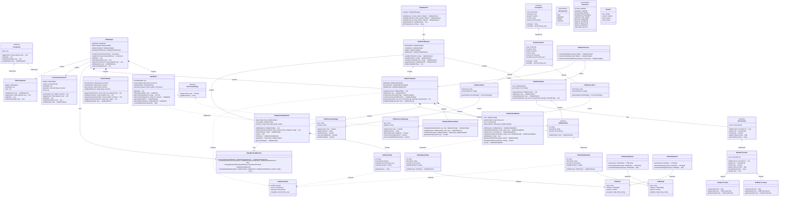

```mermaid
classDiagram
    %% Core Interfaces
    class Component {
        <<interface>>
        +state: any
        +trigger(event: string, payload: any): void
        +getState(): any
        +setState(newState: any): void
        +validate(state: any): ValidationResult
    }
    
    class ValidationRule {
        <<interface>>
        +id: string
        +description: string
        +severity: ErrorSeverity
        +validate(node: any): ValidationResult
    }
    
    class ErrorTracker {
        <<interface>>
        +errors: ParserError[]
        +addError(error: ParserError): void
        +getErrors(): ParserError[]
        +hasErrors(): boolean
        +getErrorTypeCounts(): Map
        +generateSummary(): string
    }
    
    %% DOP Adapter Pattern
    class DOPAdapter {
        -dataModel: DataModel
        -behaviorModel: BehaviorModel
        -validationAdapter: ValidationAdapter
        -stateMachineMinimizer: StateMachineMinimizer
        +createFromFunctional(config): Component
        +createFromClass(componentClass): Component
        +getState(): any
        +setState(newState: any): void
        +applyTransition(name: string, payload: any): void
        +validate(state: any): ValidationResult
        +optimizeStateMachine(): void
    }
    
    class DataModel {
        -immutableState: any
        -transitionMaps: Map~string, Function~
        -validationRules: ValidationRule[]
        -equivalenceClasses: Map~number, Set~State~~
        +getState(): any
        +withState(newState: any): DataModel
        +getTransitionMap(name: string): Function
        +withTransitionMap(name: string, fn: Function): DataModel
        +getValidationRules(): ValidationRule[]
        +withValidationRule(rule: ValidationRule): DataModel
        +computeEquivalenceClasses(): Map
    }
    
    class BehaviorModel {
        -stateTransitions: Map~string, Function~
        -eventHandlers: Map~string, Function~
        -lifecycleHooks: Map~string, Function~
        -validationBehaviors: Map~string, Function~
        +applyTransition(name: string, state: any, payload: any): any
        +handleEvent(name: string, payload: any): void
        +registerLifecycleHook(name: string, handler: Function): void
        +triggerLifecycleHook(name: string, args: any[]): void
        +validateState(state: any): ValidationResult
    }

    %% Validation System
    class ValidationAdapter {
        -dataModel: ValidationDataModel
        -behaviorModel: ValidationBehaviorModel
        -stateMachine: ValidationStateMachine
        +registerRule(rule: ValidationRule): void
        +validate(ast: any): ValidationResult
        +createFromFunctional(config): ValidationAdapter
        +createFromClass(validatorClass): ValidationAdapter
        +traverseNode(node: any, errors: ParserError[], warnings: ParserError[]): void
        +findApplicableRules(node: any): ValidationRule[]
    }
    
    class ValidationDataModel {
        -rules: ValidationRule[]
        -validationState: Map~string, any~
        -errors: ParserError[]
        -optimizedRules: Map~string, ValidationRule[]~
        +withRule(rule: ValidationRule): ValidationDataModel
        +withValidationState(key: string, value: any): ValidationDataModel
        +withError(error: ParserError): ValidationDataModel
        +withOptimizedRules(nodeType: string, rules: ValidationRule[]): ValidationDataModel
        +getState(key: string): any
        +getOptimizedRules(nodeType: string): ValidationRule[]
        +hasOptimizedRules(nodeType: string): boolean
        +clone(): ValidationDataModel
    }
    
    class ValidationBehaviorModel {
        +findApplicableRules(node: any, rules: ValidationRule[]): ValidationRule[]
        +applyRule(rule: ValidationRule, node: any): ValidationResult
        +optimizeRules(rules: ValidationRule[]): Map~string, ValidationRule[]~
        +getNodePosition(node: any): Position
    }
    
    class ValidationStateMachine {
        -states: Map~string, ValidationState~
        -currentState: ValidationState
        -transitions: Map~string, Map~string, string~~
        +addState(state: ValidationState): void
        +addTransition(fromStateId: string, onInput: string, toStateId: string): void
        +transition(input: string): ValidationState
        +reset(): void
        +minimize(): ValidationStateMachine
        +getStates(): Map~string, ValidationState~
        +getCurrentState(): ValidationState
    }
    
    class ValidationState {
        +id: string
        +isAccepting: boolean
        +metadata: Record~string, any~
        +equivalenceClass: number
        +getSignature(): string
    }
    
    class StateMachineMinimizer {
        +minimizeStates(stateMachine: ValidationStateMachine): ValidationStateMachine
        +computeEquivalenceClasses(states: ValidationState[], stateMachine: ValidationStateMachine): Map
        +mergeEquivalentStates(stateMachine, equivalenceClasses): ValidationStateMachine
        +computeStateSignature(state: ValidationState, stateMachine: ValidationStateMachine, partition: Set[]): string
    }
    
    %% Error Types and Tracking
    class ValidationResult {
        +isValid: boolean
        +errors: ParserError[]
        +warnings: ParserError[]
        +metadata: Record~string, any~
    }
    
    class ParserError {
        <<interface>>
        +code: ErrorCode
        +message: string
        +position: Position
        +context: string
        +severity: ErrorSeverity
        +toString(): string
        +toJSON(): Record~string, any~
    }
    
    class BaseParserError {
        +code: ErrorCode
        +message: string
        +position: Position
        +context: string
        +severity: ErrorSeverity
        +metadata: Record~string, any~
        +toString(): string
        +toJSON(): Record~string, any~
    }
    
    class HTMLParserError {
        +tokenType: string
        +expectedTokens: string[]
        +generateRecoveryStrategy(): RecoveryStrategy
    }
    
    class CSSParserError {
        +tokenType: string
        +expectedTokens: string[]
        +generateRecoveryStrategy(): RecoveryStrategy
    }
    
    class BaseErrorTracker {
        -errors: ParserError[]
        +addError(error: ParserError): void
        +getErrors(): ParserError[]
        +hasErrors(): boolean
        +getErrorTypeCounts(): Map
        +generateSummary(): string
        +clearErrors(): void
    }
    
    class HTMLErrorTracker {
        +categorizeErrors(): Map
        +getSyntaxErrors(): HTMLParserError[]
        +getSemanticErrors(): HTMLParserError[]
    }
    
    class CSSErrorTracker {
        +categorizeErrors(): Map
        +getSyntaxErrors(): CSSParserError[]
        +getSemanticErrors(): CSSParserError[]
    }
    
    %% Recovery Strategies
    class RecoveryStrategy {
        <<interface>>
        +apply(context: any): boolean
        +getDescription(): string
    }
    
    class HTMLRecoveryStrategy {
        -type: string
        -tagName: string
        +apply(context: any): boolean
        +getDescription(): string
        -skipToTag(context, tagName): boolean
        -closeUnclosedTag(context): boolean
        -removeInvalidAttribute(context): boolean
    }
    
    class CSSRecoveryStrategy {
        -type: string
        -property: string
        +apply(context: any): boolean
        +getDescription(): string
        -skipToSelector(): boolean
        -closeUnclosedBlock(): boolean
        -skipToNextRule(): boolean
    }
    
    %% AST Components
    class HTMLNode {
        +type: string
        +children: HTMLNode[]
        +position: Position
        +attributes: Map~string, string~
    }
    
    class CSSNode {
        +type: string
        +children: CSSNode[]
        +position: Position
        +properties: Map~string, string~
    }
    
    %% Rule Implementations
    class HTMLValidationRule {
        +id: string
        +description: string
        +severity: ErrorSeverity
        +targetNodeTypes: string[]
        +validate(node: HTMLNode): ValidationResult
    }
    
    class CSSValidationRule {
        +id: string
        +description: string
        +severity: ErrorSeverity
        +targetNodeTypes: string[]
        +validate(node: CSSNode): ValidationResult
    }
    
    %% Validation Engines
    class ValidationEngine {
        -rules: ValidationRule[]
        -errorTracker: ErrorTracker
        +registerRule(rule: ValidationRule): void
        +validate(ast: any): ValidationResult
        +validateNode(node: any): ValidationResult
        -traverseNode(node: any, errors: ParserError[], warnings: ParserError[]): void
    }
    
    class ValidationManager {
        -htmlValidator: ValidationEngine
        -cssValidator: ValidationEngine
        -adapter: ValidationAdapter
        -stateMachine: ValidationStateMachine
        +validateHTML(html: string): ValidationResult
        +validateCSS(css: string): ValidationResult
        +validateCombined(source: string): ValidationResult
        +registerRule(rule: ValidationRule): ValidationResult
        -initializeStateMachine(): void
    }
    
    class ValidationAPI {
        -manager: ValidationManager
        +validate(source: string, options: Object): ValidationResult
        +validateHTML(html: string, options: Object): ValidationResult
        +validateCSS(css: string, options: Object): ValidationResult
        +registerRule(rule: ValidationRule): void
        -detectType(source: string): string
    }
    
    %% AST Optimization
    class HTMLAstOptimizer {
        +optimize(ast: HTMLNode): HTMLNode
        +minimizeStateSpaces(ast: HTMLNode): HTMLNode
        +computeNodeSignatures(ast: HTMLNode): Map
    }
    
    class CSSAstOptimizer {
        +optimize(ast: CSSNode): CSSNode
        +minimizeStateSpaces(ast: CSSNode): CSSNode
        +computeNodeSignatures(ast: CSSNode): Map
    }
    
    %% Public API components
    class FunctionalComponent {
        -adapter: DOPAdapter
        -config: FunctionalConfig
        +initialState: any
        +transitions: Record~string, Function~
        +render(state: any, trigger: Function): any
        +state: any
        +trigger(event: string, payload: any): void
        +getState(): any
        +setState(newState: any): void
        +validate(state: any): ValidationResult
    }
    
    class OOPComponent {
        -adapter: DOPAdapter
        +initialState: any
        +validate(state: any): ValidationResult
        +state: any
        +trigger(event: string, payload: any): void
        +getState(): any
        +setState(newState: any): void
    }
    
    %% Factories
    class ValidationFactory {
        +createHTMLValidator(config: Object): ValidationEngine
        +createCSSValidator(config: Object): ValidationEngine
        +createComponentValidator(component: Component): ValidationAdapter
    }
    
    %% Enums
    class ErrorSeverity {
        <<enumeration>>
        INFO
        WARNING
        ERROR
        CRITICAL
    }
    
    class ErrorCode {
        <<enumeration>>
        SYNTAX_ERROR
        SEMANTIC_ERROR
        VALIDATION_ERROR
        INCOMPLETE_ELEMENT
        UNEXPECTED_TOKEN
        MISSING_REQUIRED
        INVALID_ATTRIBUTE
        INVALID_SELECTOR
        INVALID_PROPERTY
        UNCLOSED_BLOCK
    }
    
    class Position {
        +line: number
        +column: number
        +start: number
        +end: number
    }

    %% Core Relationships
    Component <|.. FunctionalComponent : implements
    Component <|.. OOPComponent : implements
    
    DOPAdapter *-- DataModel : contains
    DOPAdapter *-- BehaviorModel : contains
    DOPAdapter *-- ValidationAdapter : contains
    DOPAdapter --> StateMachineMinimizer : uses
    DOPAdapter --> FunctionalComponent : creates
    DOPAdapter --> OOPComponent : creates
    
    ValidationAdapter *-- ValidationDataModel : contains
    ValidationAdapter *-- ValidationBehaviorModel : contains
    ValidationAdapter *-- ValidationStateMachine : contains
    ValidationAdapter --> ValidationRule : registers
    ValidationAdapter ..> ValidationResult : produces
    
    ValidationStateMachine *-- ValidationState : contains
    ValidationStateMachine --> StateMachineMinimizer : uses
    
    ValidationEngine o-- ValidationRule : contains
    ValidationEngine o-- ErrorTracker : uses
    
    ValidationManager o-- ValidationEngine : contains
    ValidationManager o-- ValidationAdapter : contains
    ValidationManager o-- ValidationStateMachine : contains
    
    ValidationAPI --> ValidationManager : uses
    
    %% Error Handling Relationships
    ParserError <|.. BaseParserError : implements
    BaseParserError <|-- HTMLParserError : extends
    BaseParserError <|-- CSSParserError : extends
    
    ErrorTracker <|.. BaseErrorTracker : implements
    BaseErrorTracker <|-- HTMLErrorTracker : extends
    BaseErrorTracker <|-- CSSErrorTracker : extends
    
    RecoveryStrategy <|.. HTMLRecoveryStrategy : implements
    RecoveryStrategy <|.. CSSRecoveryStrategy : implements
    
    HTMLParserError --> HTMLRecoveryStrategy : creates
    CSSParserError --> CSSRecoveryStrategy : creates
    
    %% Validation Rule Relationships
    ValidationRule <|.. HTMLValidationRule : implements
    ValidationRule <|.. CSSValidationRule : implements
    
    HTMLValidationRule --> HTMLNode : validates
    CSSValidationRule --> CSSNode : validates
    
    HTMLValidationRule ..> ValidationResult : produces
    CSSValidationRule ..> ValidationResult : produces
    
    %% AST Optimization Relationships
    HTMLAstOptimizer --> HTMLNode : optimizes
    CSSAstOptimizer --> CSSNode : optimizes
    
    %% Factory Relationships
    ValidationFactory --> ValidationEngine : creates
    ValidationFactory --> ValidationAdapter : creates
```