```mermaid
classDiagram
  class ValidationRule {
    <<interface>>
    +id: string
    +description: string
    +severity: ErrorSeverity
    +compatibilityMarkers: string[]
    +dependencies: string[]
    +validate(node: any): ValidationResult
    +isCompatibleWith(other: ValidationRule): boolean
    +toObject(): Record~string, any~
    +fromObject(obj: Record~string, any~): ValidationRule
    +getId(): string
    +getDependencies(): string[]
  }

  class ValidationResult~T~ {
    +isValid: boolean
    +data: T
    +errors: ValidationError[]
    +warnings: ValidationError[]
    +traces: ExecutionTrace[]
    +constructor(isValid: boolean, data: T)
    +addError(error: ValidationError): void
    +addWarning(error: ValidationError): void
    +addTrace(trace: ExecutionTrace): void
    +merge(other: ValidationResult~any~): void
    +static createValid~T~(data: T): ValidationResult~T~
    +static createInvalid~T~(error: ValidationError, data: T): ValidationResult~T~
  }

  class ValidationError {
    +code: string
    +message: string
    +source: string
    +context: string
    +severity: ErrorSeverity
    +metadata: any
    +constructor(options: ValidationErrorOptions)
  }

  class IValidationState {
    <<interface>>
    +getId(): string
    +isActive(): boolean
    +setActive(isActive: boolean): void
    +getMetadata(key?: string): any
    +setMetadata(metadata: Record~string, any~): void
    +setEquivalenceClass(equivalenceClass: number | null): void
    +getAllTransitions(): Map~string, IValidationState~
    +addTransition(event: string, targetState: IValidationState): void
    +removeTransition(event: string): void
    +getErrorRecoveryAction(event: string): Function | null
    +getAllErrorRecoveryActions(): Map~string, Function~
    +addErrorRecoveryAction(event: string, action: Function): void
    +removeErrorRecoveryAction(event: string): void
    +getRules(): ValidationRule[]
    +containsRule(ruleId: string): boolean
    +addRule(rule: ValidationRule): void
    +removeRule(ruleId: string): void
    +clearRules(): void
    +clone(): IValidationState
    +toObject(): Record~string, any~
  }

  class ValidationState {
    -stateId: string
    -active: boolean
    -metadata: Record~string, any~
    -equivalenceClass: number | null
    -transitions: Map~string, IValidationState~
    -errorRecoveryActions: Map~string, Function~
    -validationRules: ValidationRule[]
    -stateSignature: string | null
    +constructor(stateId: string, active?: boolean, metadata?: Record~string, any~, equivalenceClass?: number | null)
    +getId(): string
    +isActive(): boolean
    +setActive(isActive: boolean): void
    +getMetadata(key?: string): any
    +setMetadata(metadata: Record~string, any~): void
    +getEquivalenceClass(): number | null
    +setEquivalenceClass(equivalenceClass: number | null): void
    +getAllTransitions(): Map~string, IValidationState~
    +addTransition(event: string, targetState: IValidationState): void
    +removeTransition(event: string): void
    +getErrorRecoveryAction(event: string): Function | null
    +getAllErrorRecoveryActions(): Map~string, Function~
    +addErrorRecoveryAction(event: string, action: Function): void
    +removeErrorRecoveryAction(event: string): void
    +getRules(): ValidationRule[]
    +containsRule(ruleId: string): boolean
    +addRule(rule: ValidationRule): void
    +removeRule(ruleId: string): void
    +clearRules(): void
    +computeStateSignature(): string
    +clone(): IValidationState
    +toObject(): Record~string, any~
    +static fromObject(obj: Record~string, any~): ValidationState
  }

  class HTMLAstValidator {
    -validationEngine: ValidationEngine
    -stateMachine: ValidationStateMachine
    -ruleRegistry: Map~string, ValidationRule~
    -equivalenceClassComputer: EquivalenceClassComputer
    -enableMinimization: boolean
    -enableTracing: boolean
    +constructor(options?: HTMLAstValidatorOptions)
    -initializeStateMachine(): void
    -registerDefaultRules(): void
    +registerRule(rule: ValidationRule): HTMLAstValidator
    +getRule(ruleId: string): ValidationRule | undefined
    +getAllRules(): ValidationRule[]
    +validateAst(ast: HTMLAst): ValidationResult~HTMLAst~
    +validateNode(node: HTMLNode): ValidationResult~HTMLNode~
    -validateNodeHierarchy(node: HTMLNode): ValidationResult~HTMLNode~
    -validateNodeStructure(node: HTMLNode): ValidationResult~HTMLNode~
    -validateNodeAttributes(node: HTMLElementNode): ValidationResult~HTMLElementNode~
    -validateStateMachineData(node: HTMLNode): ValidationResult~HTMLNode~
    -minimizeValidationStateMachine(): void
    +getOptimizationMetrics(): Record~string, any~
  }

  class ValidationStateMachine {
    -states: Map~string, IValidationState~
    -currentState: IValidationState | null
    -initialState: IValidationState | null
    -history: string[]
    -listeners: StateMachineListener[]
    -isMinimized: boolean
    -equivalenceClasses: Map~number, Set~IValidationState~~
    -optimizationMetrics: object
    +constructor()
    -addInitialStates(): void
    +getAllStates(): Map~string, IValidationState~
    +getState(stateId: string): IValidationState | null
    +getCurrentState(): IValidationState | null
    +getInitialState(): IValidationState | null
    +addState(state: IValidationState): void
    +removeState(stateId: string): void
    +addTransition(fromStateId: string, event: string, toStateId: string): boolean
    +removeTransition(fromStateId: string, event: string): boolean
    +canTransition(event: string): boolean
    +transition(event: string): boolean
    +reset(): void
    +minimize(): void
    -computeStateSignature(state: IValidationState, partition: Set~IValidationState~[]): string
    +getHistory(): string[]
    +getOptimizationMetrics(): object
    +addListener(listener: StateMachineListener): void
    +removeListener(listener: StateMachineListener): void
    -notifyListeners(event: StateMachineEvent): void
    +addRuleToState(stateId: string, rule: ValidationRule): boolean
    +removeRuleFromState(stateId: string, ruleId: string): boolean
    +getRulesForState(stateId: string): ValidationRule[]
    +getStatesInEquivalenceClass(equivalenceClass: number): Set~IValidationState~ | undefined
    +getEquivalenceClasses(): Map~number, Set~IValidationState~~
    +toObject(): Record~string, any~
    +static fromObject(obj: Record~string, any~, ruleRegistry: Map~string, ValidationRule~): ValidationStateMachine
  }

  class StateMachineValidationRule {
    +id: string
    +description: string
    +severity: ErrorSeverity
    +compatibilityMarkers: string[]
    +dependencies: string[]
    +constructor(id?: string, description?: string, severity?: ErrorSeverity, compatibilityMarkers?: string[], dependencies?: string[])
    +getId(): string
    +getDependencies(): string[]
    +toObject(): Record~string, any~
    +static fromObject(obj: Record~string, any~): ValidationRule
    +fromObject(obj: Record~string, any~): ValidationRule
    +validate(node: any): ValidationResult~any~
    -validateStateSignature(node: HTMLNode): ValidationResult~HTMLNode~
    -validateTransitions(node: HTMLNode): ValidationResult~HTMLNode~
    -validateEquivalenceClass(node: HTMLNode): ValidationResult~HTMLNode~
    +isCompatibleWith(other: ValidationRule): boolean
  }

  class HTMLStructureRule {
    +id: string
    +description: string
    +severity: ErrorSeverity
    +compatibilityMarkers: string[]
    +dependencies: string[]
    +constructor(id?: string, description?: string, severity?: ErrorSeverity, compatibilityMarkers?: string[], dependencies?: string[])
    +getId(): string
    +getDependencies(): string[]
    +toObject(): Record~string, any~
    +static fromObject(obj: Record~string, any~): ValidationRule
    +fromObject(obj: Record~string, any~): ValidationRule
    +validate(node: any): ValidationResult~any~
    -validateParentChildRelationships(node: HTMLNode): ValidationResult~HTMLNode~
    -validateElementNesting(element: HTMLElementNode): ValidationResult~HTMLElementNode~
    -checkForNestedElements(element: HTMLElementNode, tagToCheck: string, result: ValidationResult~HTMLElementNode~): void
    -validateRequiredAttributes(element: HTMLElementNode): ValidationResult~HTMLElementNode~
    +isCompatibleWith(other: ValidationRule): boolean
  }

  class AttributeValidationRule {
    +id: string
    +description: string
    +severity: ErrorSeverity
    +compatibilityMarkers: string[]
    +dependencies: string[]
    +constructor(id?: string, description?: string, severity?: ErrorSeverity, compatibilityMarkers?: string[], dependencies?: string[])
    +getId(): string
    +getDependencies(): string[]
    +toObject(): Record~string, any~
    +static fromObject(obj: Record~string, any~): ValidationRule
    +fromObject(obj: Record~string, any~): ValidationRule
    +validate(node: any): ValidationResult~any~
    -validateAttributeValues(element: HTMLElementNode): ValidationResult~HTMLElementNode~
    -validateDuplicateClasses(element: HTMLElementNode): ValidationResult~HTMLElementNode~
    +isCompatibleWith(other: ValidationRule): boolean
  }

  ValidationRule <|-- StateMachineValidationRule
  ValidationRule <|-- HTMLStructureRule
  ValidationRule <|-- AttributeValidationRule
  IValidationState <|.. ValidationState
  ValidationStateMachine o-- "many" IValidationState
  HTMLAstValidator o-- ValidationStateMachine
  HTMLAstValidator o-- "many" ValidationRule
  ValidationState o-- "many" ValidationRule
```

I'll complete the UML diagram and show how the components interact in the state validation framework based on Nnamdi Okpala's automaton state minimization technology.

I've completed the implementation of Nnamdi Okpala's automaton state minimization framework for HTML AST validation. Let me walk you through the architecture and the key components of the system.

## System Architecture

The implementation follows a modular design that separates concerns across multiple components:

1. **Validation Rules** - Define validation logic for specific aspects of HTML nodes
2. **Validation State Machine** - Implements Okpala's automaton state minimization algorithm
3. **Validation States** - Represent states in the validation state machine
4. **HTML AST Validator** - Orchestrates validation using rules and state machine

## Key Components

### ValidationRule Implementations

1. **HTMLStructureRule** - Validates parent-child relationships and element nesting rules
2. **AttributeValidationRule** - Validates HTML attributes for correctness and completeness
3. **StateMachineValidationRule** - Validates state machine data for automaton minimization

These implementations are based on the `ValidationRule` interface, which provides a consistent contract for all validation rules.

### ValidationStateMachine

This component is the core of Okpala's automaton state minimization. It handles:
- State transitions and validation phase management
- State equivalence class computation
- Optimization of the validation process through state minimization

The implementation includes a robust algorithm for finding equivalent states based on their signatures and transition behaviors, which is key to Okpala's approach.

### ValidationState

The `ValidationState` class represents individual states in the automaton. Each state:
- Maintains its transitions to other states
- Contains validation rules applicable at that state
- Computes state signatures for equivalence determination
- Supports serialization for persistent storage

### HTMLAstValidator

This orchestrator component coordinates the validation process by:
- Initializing the state machine with validation phases
- Registering validation rules in appropriate phases
- Executing validation rules on HTML nodes
- Optimizing the validation process through state minimization

## Implementation Notes

1. **Optimization Strategy**: The implementation applies Okpala's state minimization algorithm by computing signatures for states and grouping them into equivalence classes. This reduces the number of states needed for validation, improving performance.

2. **Error Recovery**: The system includes error recovery mechanisms that allow validation to continue even when errors are encountered, with appropriate state transitions.

3. **Tracing Support**: Execution tracing is implemented for diagnostic purposes, providing insights into the validation process and state transitions.

4. **Rule Registration**: Rules are registered with specific validation phases, allowing for proper separation of concerns and execution order.

## Testing

I've implemented comprehensive test suites for each component:

1. **Unit Tests**: For individual components like ValidationState and ValidationRule implementations
2. **Integration Tests**: To verify the interaction between components
3. **Validation Tests**: To ensure the validator produces correct results for various HTML structures

The tests follow a rigorous TDD approach, ensuring that the implementation meets requirements and handles edge cases correctly.

## Performance Considerations

The implementation of Okpala's automaton state minimization provides significant performance improvements:

1. **Reduced State Space**: By identifying and merging equivalent states, the number of states needed for validation is minimized.
2. **Optimized Transitions**: Transitions between states are optimized to reduce overhead.
3. **Efficient Rule Execution**: Rules are executed only in applicable validation phases.

This approach should provide the performance characteristics needed for efficient HTML validation in the OBIX project, aligning with Nnamdi Okpala's breakthrough technology.

