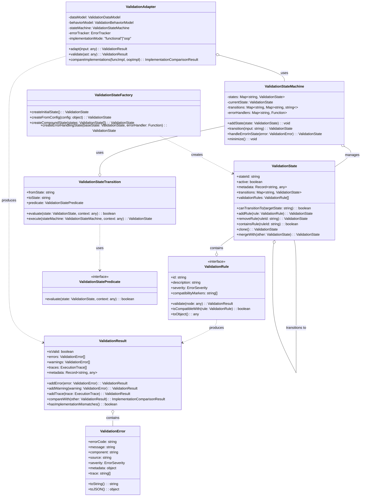

```mermaid
classDiagram
    %% Core Components
    class ValidationState {
        +stateId: string
        +active: boolean
        +metadata: Record~string, any~
        +transitions: Map~string, ValidationState~
        +validationRules: ValidationRule[]
        +canTransitionTo(targetState: string): boolean
        +addRule(rule: ValidationRule): ValidationState
        +removeRule(ruleId: string): ValidationState
        +containsRule(ruleId: string): boolean
        +clone(): ValidationState
        +mergeWith(other: ValidationState): ValidationState
    }
    
    class ValidationRule {
        <<interface>>
        +id: string
        +description: string
        +severity: ErrorSeverity
        +compatibilityMarkers: string[]
        +validate(node: any): ValidationResult
        +isCompatibleWith(rule: ValidationRule): boolean
        +toObject(): any
    }
    
    class ValidationResult {
        +isValid: boolean
        +errors: ValidationError[]
        +warnings: ValidationError[]
        +traces: ExecutionTrace[]
        +metadata: Record~string, any~
        +addError(error: ValidationError): ValidationResult
        +addWarning(warning: ValidationError): ValidationResult
        +addTrace(trace: ExecutionTrace): ValidationResult
        +compareWith(other: ValidationResult): ImplementationComparisonResult
        +hasImplementationMismatches(): boolean
    }
    
    class ValidationError {
        +errorCode: string
        +message: string
        +component: string
        +source: string
        +severity: ErrorSeverity
        +metadata: object
        +trace: string[]
        +toString(): string
        +toJSON(): object
    }
    
    %% Adapter and Connection Components
    class ValidationAdapter {
        -dataModel: ValidationDataModel
        -behaviorModel: ValidationBehaviorModel
        -stateMachine: ValidationStateMachine
        -errorTracker: ErrorTracker
        -implementationMode: "functional"|"oop"
        +adapt(input: any): ValidationResult
        +validate(ast: any): ValidationResult
        +compareImplementations(funcImpl, oopImpl): ImplementationComparisonResult
    }
    
    class ValidationStateMachine {
        -states: Map~string, ValidationState~
        -currentState: ValidationState
        -transitions: Map~string, Map~string, string~~
        -errorHandlers: Map~string, Function~
        +addState(state: ValidationState): void
        +transition(input: string): ValidationState
        +handleErrorInState(error: ValidationError): ValidationState
        +minimize(): void
    }
    
    class ValidationStateFactory {
        +createInitialState(): ValidationState
        +createFromConfig(config: object): ValidationState
        +createCompoundState(states: ValidationState[]): ValidationState
        +createErrorHandlingState(baseState: ValidationState, errorHandler: Function): ValidationState
    }
    
    class ValidationStatePredicate {
        <<interface>>
        +evaluate(state: ValidationState, context: any): boolean
    }
    
    class ValidationStateTransition {
        +fromState: string
        +toState: string
        +predicate: ValidationStatePredicate
        +evaluate(state: ValidationState, context: any): boolean
        +execute(stateMachine: ValidationStateMachine, context: any): ValidationState
    }
    
    %% Relationships
    ValidationState --o ValidationRule : contains
    ValidationState --o ValidationState : transitions to
    ValidationRule ..> ValidationResult : produces
    ValidationResult o-- ValidationError : contains
    ValidationAdapter o-- ValidationStateMachine : uses
    ValidationStateMachine o-- ValidationState : manages
    ValidationStateFactory ..> ValidationState : creates
    ValidationStateTransition ..> ValidationStatePredicate : uses
    ValidationAdapter ..> ValidationResult : produces
    ValidationStateMachine --o ValidationStateTransition : uses
```