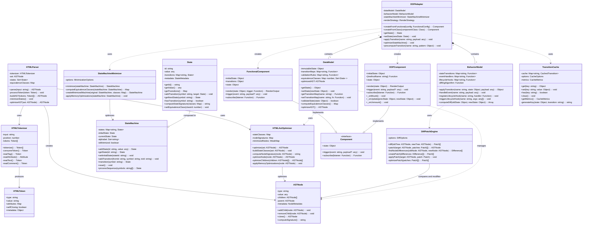

```mermaid
classDiagram
    %% Core Components
    class DOPAdapter {
        -dataModel: DataModel
        -behaviorModel: BehaviorModel
        -stateMachineMinimizer: StateMachineMinimizer
        -renderStrategy: RenderStrategy
        +createFromFunctional(config: FunctionalConfig): Component
        +createFromClass(componentClass: Class): Component
        +getState(): State
        +setState(newState: State): void
        +applyTransition(name: string, payload: any): void
        +optimizeStateMachine(): void
        +precomputeTransition(name: string, pattern: Object): void
    }

    class DataModel {
        -immutableState: Object
        -transitionMaps: Map~string, Function~
        -validationRules: Map~string, Function~
        -equivalenceClasses: Map~number, Set~State~~
        -optimizedAST: ASTNode
        +getState(): Object
        +setState(newState: Object): void
        +getTransitionMap(name: string): Function
        +setTransitionMap(name: string, fn: Function): void
        +validateState(state: Object): boolean
        +computeEquivalenceClasses(): Map
        +optimizeAST(): ASTNode
    }

    class BehaviorModel {
        -stateTransitions: Map~string, Function~
        -eventHandlers: Map~string, Function~
        -lifecycleHooks: Map~string, Function~
        -diffingAlgorithm: Function
        +applyTransition(name: string, state: Object, payload: any): Object
        +handleEvent(name: string, payload: any): void
        +registerLifecycleHook(name: string, handler: Function): void
        +triggerLifecycleHook(name: string, args: any[]): void
        +computeDiff(oldState: Object, newState: Object): Array
    }

    %% Parser Components
    class HTMLParser {
        -tokenizer: HTMLTokenizer
        -ast: ASTNode
        -states: Set~State~
        -equivalenceClasses: Map
        +parse(input: string): ASTNode
        -processToken(token: Token): void
        -buildAST(tokens: Token[]): ASTNode
        -minimizeStates(): void
        -optimizeAST(ast: ASTNode): ASTNode
    }

    class HTMLTokenizer {
        -input: string
        -position: number
        -tokens: Token[]
        +tokenize(): Token[]
        -consumeToken(): Token
        -readTag(): Token
        -readAttribute(): Attribute
        -readText(): Token
        -readComment(): Token
    }

    class HTMLToken {
        +type: string
        +value: string
        +attributes: Map
        +selfClosing: boolean
        +metadata: Object
    }

    class HTMLAstOptimizer {
        -stateClasses: Map
        -nodeSignatures: Map
        -minimizedNodes: WeakMap
        +optimize(ast: ASTNode): ASTNode
        -buildStateClasses(ast: ASTNode): void
        -computeNodeSignature(node: ASTNode): string
        -optimizeNode(node: ASTNode): ASTNode
        -optimizeChildren(children: ASTNode[]): ASTNode[]
        -applyMemoryOptimizations(node: ASTNode): void
    }

    %% State Machine Components
    class StateMachine {
        -states: Map~string, State~
        -initialState: State
        -currentState: State
        -alphabet: Set~string~
        -isMinimized: boolean
        +addState(id: string, value: any): State
        +getState(id: string): State
        +setInitialState(stateId: string): void
        +addTransition(fromId: string, symbol: string, toId: string): void
        +transition(symbol: string): State
        +reset(): void
        +processSequence(symbols: string[]): State
    }

    class State {
        -id: string
        -value: any
        -transitions: Map~string, State~
        -metadata: StateMetadata
        +getId(): string
        +getValue(): any
        +getTransitions(): Map
        +addTransition(symbol: string, target: State): void
        +getNextState(symbol: string): State
        +hasTransition(symbol: string): boolean
        +computeStateSignature(classes: Map): string
        +setEquivalenceClass(classId: number): void
    }

    class StateMachineMinimizer {
        -options: MinimizationOptions
        +minimize(stateMachine: StateMachine): StateMachine
        -computeEquivalenceClasses(stateMachine: StateMachine): Map
        -createMinimizedMachine(original: StateMachine, classes: Map): StateMachine
        -applyMemoryOptimizations(stateMachine: StateMachine): void
    }

    %% Diff and Patch Engine
    class DiffPatchEngine {
        -options: DiffOptions
        +diff(oldTree: ASTNode, newTree: ASTNode): Patch[]
        +patch(target: ASTNode, patches: Patch[]): ASTNode
        -findNodeDifferences(oldNode: ASTNode, newNode: ASTNode): Difference[]
        -createPatch(differences: Difference[]): Patch[]
        -applyPatch(target: ASTNode, patch: Patch): void
        -optimizePatch(patches: Patch[]): Patch[]
    }

    %% AST Components
    class ASTNode {
        -type: string
        -value: any
        -children: ASTNode[]
        -parent: ASTNode
        -metadata: NodeMetadata
        +addChild(node: ASTNode): void
        +removeChild(node: ASTNode): void
        +clone(): ASTNode
        +computeSignature(): string
    }

    %% Public APIs
    class Component {
        <<interface>>
        +state: Object
        +trigger(event: string, payload?: any): void
        +subscribe(listener: Function): Function
    }

    class FunctionalComponent {
        +initialState: Object
        +transitions: Object
        +render(state: Object, trigger: Function): RenderOutput
        +state: Object
        +trigger(event: string, payload?: any): void
        +subscribe(listener: Function): Function
    }

    class OOPComponent {
        +initialState: Object
        +[methodName: string]: Function
        +render(state: Object): RenderOutput
        +state: Object
        +trigger(event: string, payload?: any): void
        +subscribe(listener: Function): Function
        +_onMount(): void
        +_onUpdate(prevState: Object, newState: Object): void
        +_onUnmount(): void
    }

    %% Caching System
    class TransitionCache {
        -cache: Map~string, CachedTransition~
        -options: CacheOptions
        -metrics: CacheMetrics
        +get(key: string): Object
        +set(key: string, value: Object): void
        +has(key: string): boolean
        +clear(): void
        +getMetrics(): CacheMetrics
        -generateKey(state: Object, transition: string): string
    }

    %% Relationships
    DOPAdapter ..> StateMachineMinimizer : uses
    DOPAdapter "1" *-- "1" DataModel : contains
    DOPAdapter "1" *-- "1" BehaviorModel : contains
    DOPAdapter ..> TransitionCache : uses
    DOPAdapter ..> FunctionalComponent : creates
    DOPAdapter ..> OOPComponent : creates
    
    FunctionalComponent --|> Component : implements
    OOPComponent --|> Component : implements
    
    StateMachineMinimizer --> StateMachine : optimizes
    State --o StateMachine : composed in
    
    HTMLParser --> HTMLTokenizer : uses
    HTMLParser --> HTMLAstOptimizer : uses
    HTMLParser --> ASTNode : creates
    HTMLTokenizer --> HTMLToken : produces
    
    HTMLAstOptimizer --> ASTNode : optimizes
    
    DiffPatchEngine --> ASTNode : compares and modifies
    
    BehaviorModel ..> DiffPatchEngine : uses
    DataModel ..> HTMLAstOptimizer : uses
    DataModel ..> ASTNode : manages
```